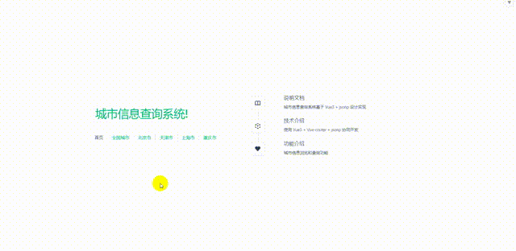

# vue3-jsonp--city-adress-query

《Vue.js+Node.js全栈开发实战（第二版） (王金柱 编著)》第十四章城市信息查询项目

## 技术栈
- Vue3
- Vite
- jsonp
- vue-router

## 演示


## 项目启动

### 安装依赖
```sh
npm install
```

### 运行

```sh
npm run dev
```

### 打包

```sh
npm run build
```
